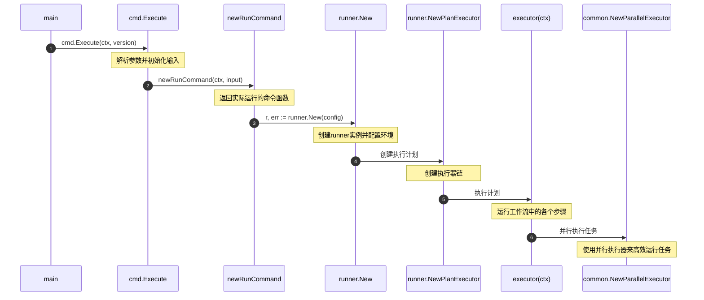
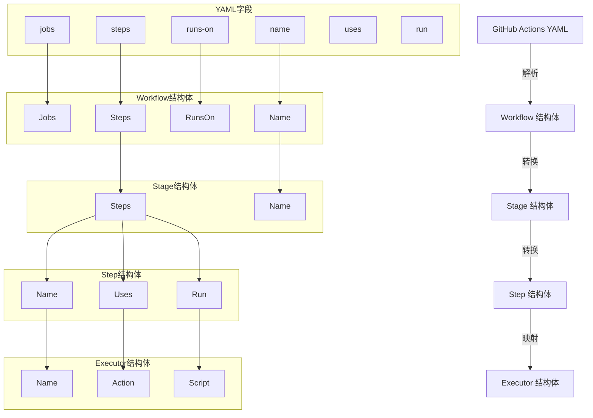
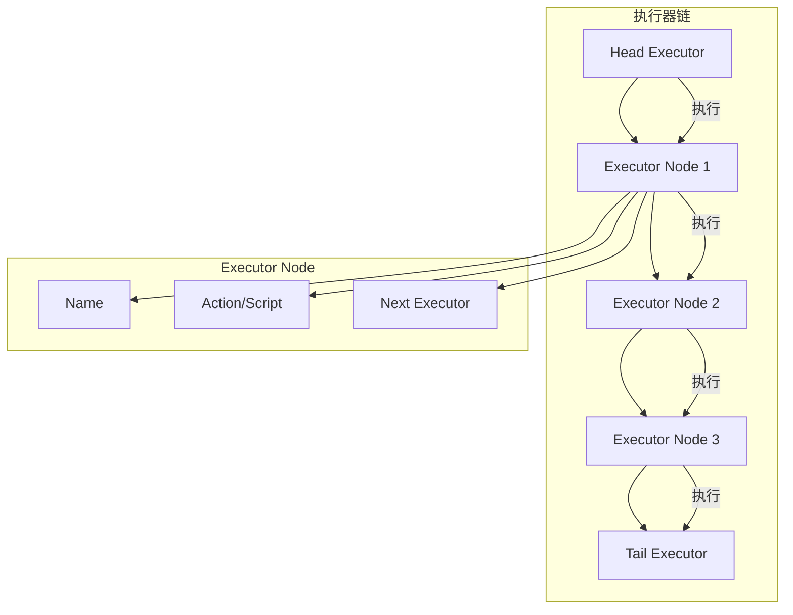

好的，以下是两个图表来说明GitHub Actions YAML文件中的字段如何映射到执行器链中的字段，以及执行器链的结构。

### 图1：GitHub Actions YAML字段到执行器链字段的映射

### 图2：执行器链结构

### 解释

1. **GitHub Actions YAML字段到执行器链字段的映射**：
   - YAML文件中的字段（如`jobs`、`steps`、`runs-on`等）首先被解析为`Workflow`结构体。
   - `Workflow`结构体中的字段（如`Jobs`、`Steps`等）被转换为`Stage`结构体。
   - `Stage`结构体中的字段（如`Steps`、`Name`等）被转换为`Step`结构体。
   - `Step`结构体中的字段（如`Name`、`Uses`、`Run`等）被映射到`Executor`结构体中的字段（如`Name`、`Action`、`Script`等）。

2. **执行器链结构**：
   - 执行器链是一个链表结构，每个节点都是一个`Executor`。
   - 链的头部是`Head Executor`，尾部是`Tail Executor`。
   - 每个`Executor`节点包含`Name`、`Action/Script`和指向下一个`Executor`的指针`Next Executor`。
   - 执行器链按顺序执行每个`Executor`节点，直到链的尾部。

通过这两个图表，可以更清晰地理解GitHub Actions YAML文件中的字段是如何映射到执行器链中的字段，以及执行器链的结构和执行流程。
