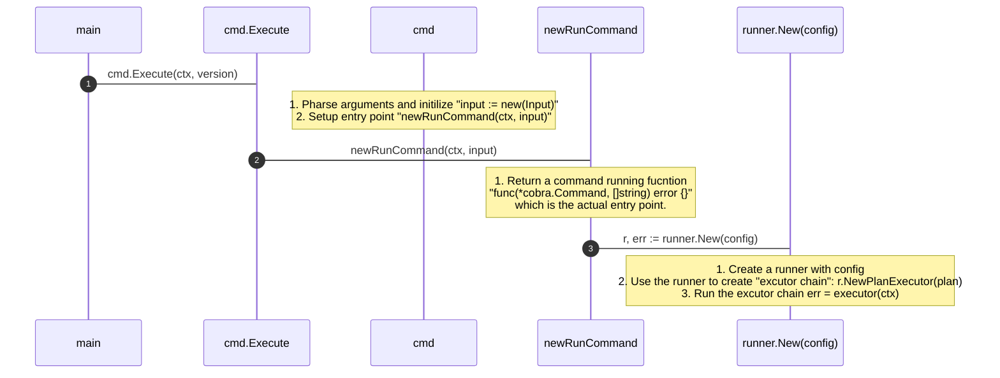
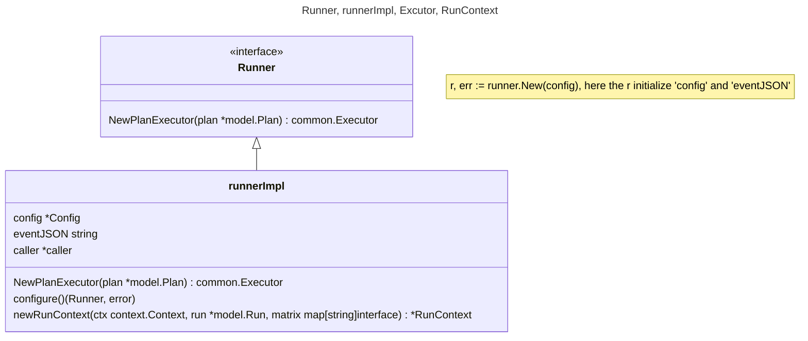
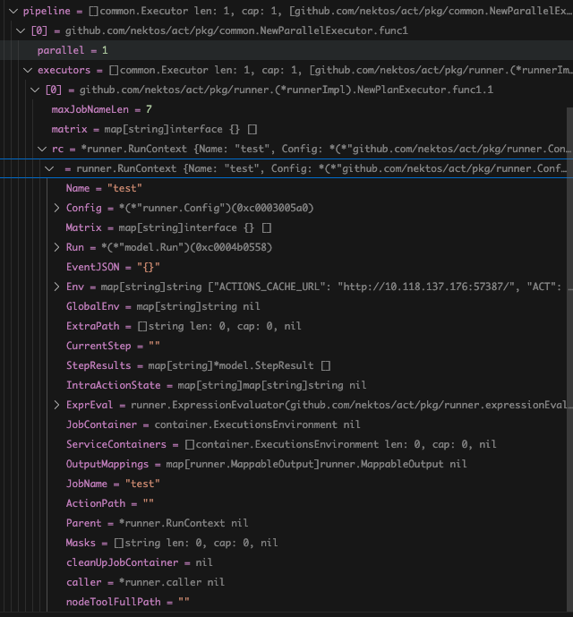
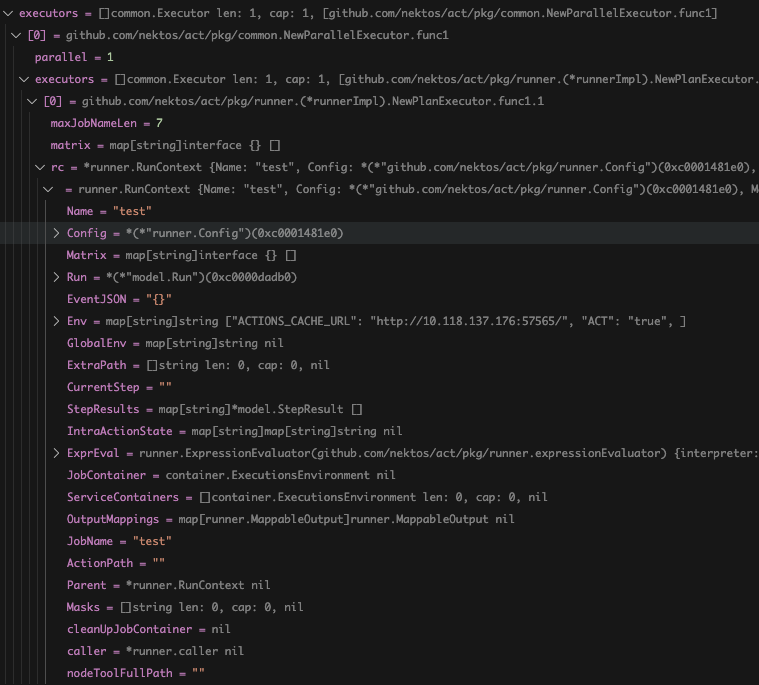

# Code Analysis

## Sequence: Start Process from main() to executor(ctx)


## Runner, runnerImpl, Excutor, RunContext
### Who created the runner and runnerIml?
The r, err := runner.New(config) created an instance of runnerImpl then setup all the config like

* Workdir: where the github action workflow file is
* EventName: push
* Toke

search the `type Config struct {` for detail



### Excutor, RunContext
```golang
// Executor define contract for the steps of a workflow
type Executor func(ctx context.Context) error
```
NewPlanExecutor() will create a list of Executor which actually a list of function, search the code below for detail
```golang
// from runner.go => func (runner *runnerImpl) NewPlanExecutor(plan *model.Plan) common.Executor {
stagePipeline := make([]common.Executor, 0)

// code snippet
for i := range plan.Stages {
    stage := plan.Stages[i]
    stagePipeline = append(stagePipeline, func(ctx context.Context) error {}
```

## What is WorkflowPlanner, Plan, Stage, StagePipeline, job etc.
### What is WorkflowPlanner, Plan,
```golang
// 1. What is palnner
// root.go => newRunCommand
planner, err := model.NewWorkflowPlanner(input.WorkflowsPath(), input.noWorkflowRecurse)
// planner.go
func NewWorkflowPlanner(path string, noWorkflowRecurse bool) (WorkflowPlanner, error) {}

// planner contains a list of workflow which phrase from .github/workflows
// mode.workflow contains all the data fetched from specific workflow yaml file

// 2. What is plan
// plan contains data based on event, envent means "push" etc..
// plan reconstruct the workflow yaml file based on the event
plan, plannerErr = planner.PlanEvent(eventName)
```

a snnipt from code show the stucture of some concept
```golang
// WorkflowPlanner contains methods for creating plans
type WorkflowPlanner interface {
	PlanEvent(eventName string) (*Plan, error)
	PlanJob(jobName string) (*Plan, error)
	PlanAll() (*Plan, error)
	GetEvents() []string
}

// Plan contains a list of stages to run in series
type Plan struct {
	Stages []*Stage
}

// Stage contains a list of runs to execute in parallel
type Stage struct {
	Runs []*Run
}

// Run represents a job from a workflow that needs to be run
type Run struct {
	Workflow *Workflow
	JobID    string
}
```
Below are some values of the concept above


### What is Stage, StagePipeline, pipeline
* Oif one stage depends on the other, then there will be 2 stages
* Below is pipeline


* ne Job map to an executor, an executor contains everything that needed for a container to run(!!!!!!!!This is very important!!!!!!!)


Below is the place where the job truly run
```golang
for i := 0; i < parallel; i++ {
	go func(work <-chan Executor, errs chan<- error) {
		for executor := range work {
			errs <- executor(ctx)
		}
	}(work, errs)
}
```