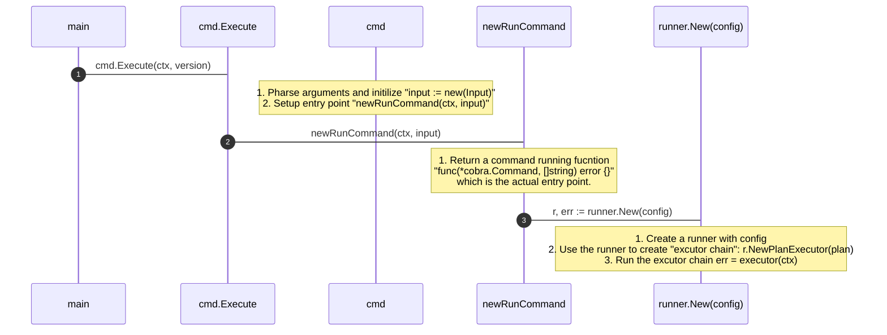
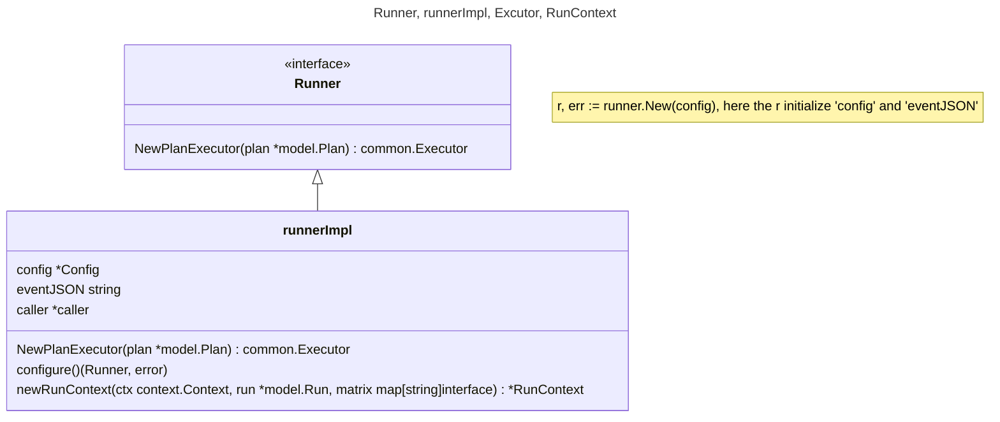

# Code Analysis

## Sequence: Start Process from main() to executor(ctx)


## Runner, runnerImpl, Excutor, RunContext
### Who created the runner and runnerIml?
The r, err := runner.New(config) will create an instance of runnerImpl then setup all the config like

* Workdir: where the github action workflow file is
* EventName: push
* Toke

search the `type Config struct {` for detail



### Excutor, RunContext
```golang
// Executor define contract for the steps of a workflow
type Executor func(ctx context.Context) error
```
NewPlanExecutor() will create a list of Executor which actually a list of function, search the code below for detail
```golang
// from runner.go => func (runner *runnerImpl) NewPlanExecutor(plan *model.Plan) common.Executor {
stagePipeline := make([]common.Executor, 0)

// code snippet
for i := range plan.Stages {
    stage := plan.Stages[i]
    stagePipeline = append(stagePipeline, func(ctx context.Context) error {}
```

## What is Plan, Stage, StagePipeline, job etc.
